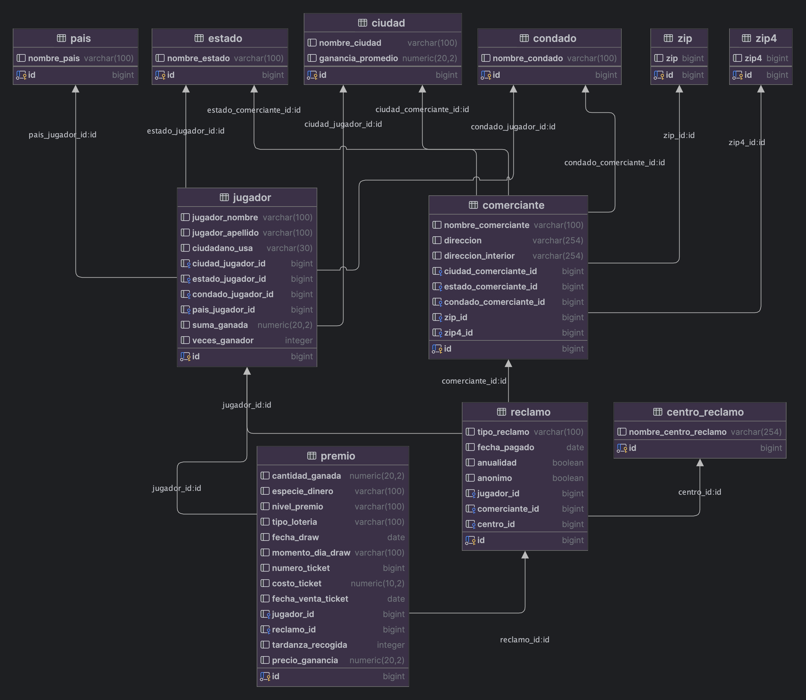

# Proyecto BD: Premios lotería Texas

## Integrantes
<ul>
  <li>Andrés Álvarez Flores 208450</li>
  <li>Nicolás Álvarez Ortega 206379</li>
</ul>


## Introducción al conjunto de datos y al problema a estudiar
El presente conjunto de datos es una recopilación de premios de lotería ganados en Texas (cabe mencionar que los datos tomados fueron por última vez actualizados el 30 de abril de 2024 en el momento de extracción, aunque sean actualizados periódicamente, y fueron creados el 1 de septiembre de 2023, aunque hay registros anteriores al 2023). El conjunto de datos original consta de:
<ul>
    <li>35 columnas </li>
    <li>2.7 millones de renglones (cada uno es un registro de un premio ganado) </li>
</ul>
Las columnas contienen información alrededor del premio que fue ganado, algunas de ellas son:
<ul>
    <li>Identificador único del premio </li>
    <li>Cantidad ganada </li>
    <li>Tipo y nivel de premio </li>
    <li>Fecha de compra de ticket y reclamo de premio </li>
    <li>Indicadores de anualidad y anonimato </li>
    <li>Información del jugador </li>
    <li>Información del comerciante </li>
</ul>
A primera vista el conjunto no está normalizado y existen aún ciertas dependencias multivaluadas que tendrán que ser corregidas para separar la información independiente en diferentes relaciones. De la misma manera, el conjunto de datos proporciona la información del premio ganado, del jugador y del comerciante que vendió el ticket de las diferentes loterias. La mayoría de los atributos estan en formato de texto simple y parece que hay algunos que pueden ser utilizados posteriormente como llaves primarias de las relaciones que se definirán en un futuro. Este conjunto de datos no es solo local, sino que incluye a ganadores de diferentes regiones del mundo, aunque los premios reclamados deben ser en Texas. Nuestro principal propósito es analizar, a través de consultas de SQL y conocimiento general de bases de datos, ciertos patrones observables en los ganadores y como se lleva a cabo la recopilación de datos y la recolección de premios. Esto es, aplicar los conocimientos aprendidos durante el curso para analizar una base de datos compleja, desde el ingesto inicial desde una fuente datos hasta la creación de atributos para un posible futuro entrenamiento de modelos. En cuanto a las consideraciones e implicaciones éticas consideramos que no hay ninguna, ya que la fuente de datos incluye la opción de mantenerse anónimo para ganadores de premios con valor mayor a 1 millon de dólares. El propósito de este repositorio es la explicación de las decisiones tomadas durante el proyecto para la realización de consultas analíticas y la replicación del mismo.


## Fuente de datos
Para este proyecto se utilizaron los datos obtenidos del portal público de datos del estado de Texas sobre la lista de ganadores de premios de loteria (actualizada por última vez el 30 de abril de 2024). Se consultar los datos en [este link](https://data.texas.gov/dataset/Winners-List-of-Texas-Lottery-Prizes/54pj-3dxy/about_data). 


## Carga inicial de datos y análisis preeliminar

Para insertar los datos en bruto en una sola tabla que los contenga todos se debe primero ejecutar el script `raw_data_esquema_tabla.sql` en el IDE de su preferencia. Posteriormente, en una sesión de terminal 'SQL Shell' crear una base de datos con un nombre a elección con el comando:

```{postgresql}
\CREATE DATABASE nombre_a_elegir;
```
Después, conectarse a aquella base de datos recién creada con el comando:

```{postgresql}
\c nombre_elegido;
```
Y finalmente, ejecutar el siguiente comando: 

```{postgresql}
\copy
    raw_data.loteria (row_id, numero_reclamo, cantidad_ganada, fecha_reclamo_pagado, id_jugador, indicador_anualidad, indicador_anonimo, ubicacion_centro_reclamo, tipo_reclamo, ciudadano_usa, jugador_apellido, jugador_nombre, nombre_y_id_jugador, ciudad_jugador, estado_jugador, condado_jugador, pais_jugador, especie_dinero, tipo_loteria, fecha_draw, momento_dia_draw, nivel_premio, fecha_venta_ticket, numero_ticket, costo_ticket, numero_comerciante, nombre_comerciante, numero_nombre_comerciante, direccion1_comerciante, direccion2_comerciante, ciudad_comerciante, estado_comerciante, codigo_zip_comerciante, codigo_zip4_comerciante, condado_comerciante)
    FROM '/Users/andres/Desktop/Winners_List_of_Texas_Lottery__Prizes_20240507.csv'
    WITH (FORMAT CSV, HEADER true, DELIMITER ',');
```
De esta forma, ya se tendrá en el IDE una sola tabla con toda la información del conjunto original para la posterior limpieza y normalización.


## Limpieza de datos

El proceso de limpieza de datos se puede ver en el scrpit llamado: ```limpieza_datos.sql```. Este se realiza de tal manera que cada vez que se ejecute el script completo se hará la limpieza entera de los datos, desde la creación de cero del esquema y las consultas necesarias para ir limpiando las columnas que así lo requieran. Encontramos diversos problemas en esta tabla al momento de la limpieza que debimos solucionar:
<ul>
  <li>Prácticamente todas las columnas no eran consistentes con su formato de texto (contenían caracteres en minúsculas y mayúsculas, y contenían espacios al inicio y final de los registros), por lo que lo solucionamos con funciones de TRIM() y UPPER(). </li>
  <li>Las fechas registradas en el conjunto de datos decían tener la hora cuando no los tenían, por lo que tuvimos que cambiar su tipo a DATE en lugar de TIMESTAMP. </li>
  <li>El id, a pesar de ser único, era muy difícil de leer y contenía tanto números como caracteres, por lo que decidimos dar un nuevo id único que fuera más fácil de manejar con un BIGSERIAL y eliminando el anterior. </li>
  <li>Los indicadores de anualidad y anonimato solamente tenían dos registros distintos (YES y NO) por lo que los convertimos en valores booleanos siguiendo el estándar (igualmente ciudadano_USA podría ser un booleano pero contenía registros de UNKNOWN y NOT PROVIDED, por lo que no pudimos realizar la limpieza en ese atributo). </li>
  <li>Los id de jugador y reclamo se repetían, lo que tiene sentido si consideramos que un jugador puede tener muchos premios y un reclamo puede contener muchos premios, el problema fue que el id de reclamo no era único, es decir, existían reclamos distintos con con el mismo identificador. Por lo anterior, decidimos observar cuales tenían el conflicto (más de 500000 registros) para crear una secuencia y asignar nuevos números de reclamo para que no se duplicaran, cuidado que los nuevos no estuvieran ya en el conjunto de datos (inicializando la secuencia en un número superior al id de reclamo mayor). </li>
  <li>Si el id de jugador era nulo lo hicimos igual a -1 (no repetido). </li>
  <li>Eliminamos un par de columnas (nombre_y_id_jugador y numero_nombre_comerciante) que contenían información obsoleta, ya que eran una concatenación de columnas con información que ya contenía el conjunto de datos. Hicimos esto cuidando que estas columnas fueran consistente con la información que concatenaban de otras columnas. </li>
  <li>Las columnas de ciudad_jugador, estado_jugador, condado_jugador, pais_jugador, ciudad_comerciante, estado_comerciante y condado comerciante todas tenían algunos errores de dedo al momento de insertar la información al conjunto de datos. Es decir, había nombres que hacían referencia al mismo sitio pero estaban escritos de forma incorrecta, por lo que tuvimos que corregirlos con las funciones de CASE: WHEN revisando entrada por entrada. Debemos hacer una mención especial a la columna de ciudad_jugador, esta columna contenía más de 14500 valores distintos y requerimos de 1600 líneas de código para limpiarlas porque había demasiadas inconsistencias en la escritura de las mismas. Así, pudimos obtener una(s) columna(s) consistente(s) para que efectivamente arrojaran los resultados deseados en las consultas. </li>
  <li>Las columnas de tipo_loteria, momento_dia_draw y nivel_premio requirieron de una limpieza mínima para eliminar caracteres no desearlos y que los registros contenidos fueran consistentes. </li>
  <li>Había una gran cantidad de columnas que contenían valores nulos no explícitos (esto es, palabras para representar un valor nulo), por lo que los adaptamos el estándar y los hicimos nulos. </li>
</ul>

Al finalizar la limpieza terminamos con una fuente de datos manejable y coherente en sus registros. Si bien es cierto que existen algunos valores nulos por falta de registros por parte de la fuente misma, creemos que la masividad de los datos nos permitirá extraer datos suficientemente relevantes,

## Normalización de datos hasta cuarta forma normal

El proceso de normalización consiste en la descomposición de una entidad (tabla) en diversas para que mantengan ciertos requisitos (según la forma normal deseada) y obtengan coherencia. Este proceso fue realizado de tal forma que se puede consultar en el script `normalizacion.sql` y fue hecho de forma que se ejecute todo el script de corrido y en cualquier momento pueda ser eliminado para comenzar de nuevo. Algunos de los retos enfrentados en este proceso fueron: la organización de tablas según su id único, es decir, que una consulta general del tipo:
```{postgresql}
SELECT *
FROM nombre_tabla;
```
arrojara los resultados de tal forma que se vieran ordenados, la creación de nuevos índices con BIGSERIAL para adecuar identificadores más fáciles (este fue un reto debio a las llaves foráneas que debían implementar el nuevo identificado) y la adición manual de las llaves foráneas para los casos nulos.

Con el propósito de normalizar la tabla inicial hasta cuarta forma normal pudimos encontrar las siguientes dependencias funcionales (FDs) no triviales para llegar hasta la forma normal de Boyce-Codd: (notar que E representa el encabezado de la tabla, es decir, todos los atributos de la tabla)
<ul>
    <li>{premio_id} -> {E} </li>
    <li>{numero_reclamo} -> {tipo_reclamo, fecha_reclamo_pagado, indicador_anualidad, indicador_anonimo, centro_id, jugador_id, comerciante_id} </li>
    <li>{jugador_id} -> {jugador_nombre,  jugador_apellido, ciudadano_usa, ciudad_jugador_id, estado_jugador_id, condado_jugador_id, pais_jugador_id} </li>
    <li>{numero_comerciante} -> {nombre_comerciante, direccion1_comerciante, direccion2_comerciante, ciudad_comerciante_id, estado_comerciante_id, condado_comerciante_id, codigo_zip_id, codigo_zip4_id} </li>
    <li>{pais_id} -> {ciudadano_usa} </li>
</ul>

De igual forma, encontramos las siguientes dependencias multivaluadas (MVDs) no triviales para poder normalizar hasta cuarta forma normal (4NF):
<ul>
    <li>{jugador_id} ->-> {premio_id} | {numero_reclamo} </li>
    <li>{numero_comerciante} ->-> {numero_reclamo} | {premio_id} </li>
    <li>{pais_id} ->-> {jugador_id} | {comerciante_id} </li>
    <li>{estado_jugador_id} ->-> {jugador_id} | {comerciante_id} </li>
    <li>{ciudad_jugador_id} ->-> {jugador_id} | {comerciante_id} </li>
    <li>{condado_jugador_id} ->-> {jugador_id} | {comerciante_id} </li>
    <li>{zip_id} ->-> {jugador_id} | {comerciante_id} </li> *Debería de incluir al jugador_id pero el jugador no cuenta con zip en este conjunto de datos
    <li>{zip4_id} ->-> {jugador_id} | {comerciante_id} </li> *Mismo caso que la MVD anterior
    <li>{pais_id} ->-> {estado_id} | {ciudad_id} </li>
</ul>
*Notar que para las MVDs se juntaron los países, estados, ciudades y condados del comerciante y jugador porque representan la misma información

Una vez termiando el análisis de las FDs y las MVDs pudimos normalizar hasta 4NF y las tablas resultantes fueron las siguientes:
<ul>
    <li>Premio: {id, cantidad_ganada, especie_dinero, nivel_premio, tipo_loteria, fecha_draw, momento_dia_draw, numero_ticket, costo_ticket, fecha_venta_ticket, jugador_id, reclamo_id} </li>
    <li>Reclamo: {id, tipo_reclamo, fecha_pagado, indicador_anualidad, indicador_anonimo, jugador_id, comerciante_id, centro_id} </li>
    <li>Jugador: {id, jugador_nombre, jugador_apellido, ciudadano_usa, ciudad_jugador_id, estado_jugador_id, condado_jugador_id, pais_jugador_id} </li>
    <li>Comerciante: {id, nombre_comerciante, direccion, direccion_interior, ciudad_comerciante_id, estado_comerciante_id, condado_comerciante_id, zip_id, zip4_id} </li>
    <li>Pais: {id, nombre_pais} </li>
    <li>Estado: {id, nombre_estado} </li>
    <li>Ciudad: {id, nombre_ciudad} </li>
    <li>Condado: {id, nombre_condado} </li>
    <li>Centro_reclamo: {id, nombre_centro_reclamo} </li>
    <li>Zip: {id, zip} </li>
    <li>Zip4: {id, zip4} </li>
</ul>

Podemos observar que en esta descoposición ya no se encuentran FDs que no salgan de súper llaves ni MVDs que no salgan de súper llaves. Esto es, a partir de una llave en la tabla (en todas se les dió el nombre al atributo de id) podemos obtener la información única contenida en la tabla y ya no existe información independiente en la misma tabla, sino que fue separada para que hubiera coherencia. Finalmente, tenemos este esquema para las tablas:


*Notar que las columnas suma_gamada, tardanza_recogida, veces_ganador, precio_ganancia y ganancia_promedio fueron añadidas posteriormente como atributos para entrenamiento de modelos.

## Análisis de datos a través de consultas de SQL

Se realizaron diversas consultas de SQL para el análisis de la base de datos, estas revelarán información valiosa que nos ayudará en nuestra conclusión para observar ciertos patrones de consumo, geolocalización y tipo de jugadores más propensos a ganar premios según atributos arbitrarios. A continuación se presentan las consultas realizadas (que pueden ser vistas en el script `querys.sql` que incluye igualmente el traspaso de las tablas al esquema público) con su correspondiente código y resultados.

<ol>
  <li>Suma de la cantidad ganada por cada jugador </li>
  
```{postgresql}
SELECT jugador_id, jugador_nombre, jugador_apellido, SUM(cantidad_ganada) AS total_ganado
FROM premio
JOIN jugador ON jugador.id = premio.jugador_id
GROUP BY jugador_id, jugador_nombre, jugador_apellido
ORDER BY total_ganado DESC;
```
  <li>Número de reclamos pagados por año </li>

```{postgresql}
SELECT EXTRACT(YEAR FROM fecha_pagado) AS año, tipo_reclamo, COUNT(id) AS reclamos_pagados
FROM reclamo
WHERE reclamo.fecha_pagado IS NOT NULL
GROUP BY año, tipo_reclamo
ORDER BY reclamos_pagados, año, tipo_reclamo;
```
  
  <li>Número de premios sin reclamar </li>

```{postgresql}
SELECT DISTINCT *
FROM jugador
JOIN premio ON jugador.id = premio.jugador_id
LEFT JOIN Reclamo  ON reclamo_id = reclamo.id
WHERE reclamo.id IS NULL;
```
  <li>Comerciante con mayor número de reclamos pagados </li>

```{postgresql}
WITH total_reclamos_pagados AS (
    SELECT comerciante.id, COUNT(reclamo.id) AS reclamos_pagados
    FROM comerciante
    JOIN reclamo ON reclamo.comerciante_id = comerciante.id
    WHERE reclamo.fecha_pagado IS NOT NULL AND comerciante.id != 1
    GROUP BY comerciante.id
    ORDER BY COUNT(reclamo.id) DESC
)
SELECT *
FROM total_reclamos_pagados
WHERE reclamos_pagados = (SELECT MAX(reclamos_pagados) FROM total_reclamos_pagados);
```
  <li>Jugador que ha ganado el premio más grande </li>

```{postgresql}
SELECT *
FROM jugador
JOIN premio ON jugador.id = premio.jugador_id
WHERE premio.cantidad_ganada = (SELECT MAX(cantidad_ganada) FROM premio);
```
  <li>Jugador que ha ganado premios en todo los tipos de loteria </li>

```{postgresql}
SELECT *
FROM jugador
JOIN (
    SELECT jugador_id, COUNT(DISTINCT tipo_loteria) AS total_loterias
    FROM premio
    GROUP BY jugador_id
) p ON jugador.id = p.jugador_id
WHERE p.total_loterias = (SELECT COUNT(DISTINCT tipo_loteria) FROM premio);
```
  <li>Cálculo del promedio de los 3 últimos premios por jugador </li>

```{postgresql}
SELECT jugador_id, jugador_nombre, jugador_apellido, cantidad_ganada,
 AVG(cantidad_ganada) OVER (PARTITION BY jugador_id ORDER BY fecha_draw ROWS BETWEEN 2 PRECEDING AND CURRENT ROW) AS promedio_movil_3_premios
 FROM jugador
 JOIN premio ON jugador.id = premio.jugador_id;
```
  <li>Cálculo de la diferencia entre la ganancia en un sorteo específico y su ganancia más baja en ese sorteo </li>

```{postgresql}
SELECT jugador_id, jugador_nombre, jugador_apellido, cantidad_ganada,
       cantidad_ganada - MIN(cantidad_ganada) OVER (PARTITION BY fecha_draw) AS diferencia_con_minimo
FROM jugador
JOIN premio ON jugador.id = premio.jugador_id
ORDER BY jugador_id;
```
  <li>Cálculo de la diferencia entre la cantidad ganada por jugador y su promedio del país </li>

```{postgresql}
SELECT jugador_id, jugador_nombre, jugador_apellido, pais_jugador_id, cantidad_ganada,
       SUM(cantidad_ganada) AS cantidad_ganada,
       cantidad_ganada - AVG(cantidad_ganada) OVER (PARTITION BY pais_jugador_id) AS diferencia_promedio_pais
FROM jugador
JOIN premio ON jugador.id = premio.jugador_id
GROUP BY jugador_id, jugador_nombre, jugador_apellido, pais_jugador_id, cantidad_ganada
ORDER BY pais_jugador_id, jugador_id;
```
  <li>Cálculo de la ganancia promedio de un jugador en comparación con el promedio de los jugadores de su estado </li>

```{postgresql}
SELECT jugador_id,
       jugador_nombre,
       jugador_apellido,
       estado_jugador_id,
       SUM(cantidad_ganada) AS dinero_ganado,
        SUM(cantidad_ganada) / AVG(cantidad_ganada) OVER (PARTITION BY estado_jugador_id) AS ratio_promedio_estado
 FROM jugador
 JOIN premio ON jugador.id = premio.jugador_id
 GROUP BY jugador_id, jugador_nombre, jugador_apellido, estado_jugador_id, cantidad_ganada
ORDER BY estado_jugador_id, jugador_id;
```
  <li>Jugadores que tienen más de un reclamo </li>

```{postgresql}
SELECT jugador.id, COUNT(DISTINCT reclamo.id)
FROM jugador
INNER JOIN reclamo ON jugador_id = jugador.id
GROUP BY jugador.id
HAVING COUNT (DISTINCT reclamo.id) > 1;
```
  <li>Ciudades con más jugadores </li>

```{postgresql}
SELECT ciudad_jugador, COUNT(*)
FROM limpieza_datos.loteria
GROUP BY ciudad_jugador
ORDER BY COUNT(*) DESC;
```
  <li>Cantidad ganada por los jugadores en el último mes </li>

```{postgresql}
SELECT jugador_id, SUM(cantidad_ganada) AS total_ganado
FROM premio
WHERE fecha_draw >= CURRENT_DATE - INTERVAL '1 month'
GROUP BY jugador_id;
```
  <li>Ganancias anuales por jugador </li>

```{postgresql}
SELECT premio.jugador_id, EXTRACT(YEAR FROM fecha_draw) AS año, AVG(cantidad_ganada) AS promedio_ganado
FROM premio
WHERE EXTRACT(YEAR FROM fecha_draw) IS NOT NULL
GROUP BY premio.jugador_id, EXTRACT(YEAR FROM fecha_draw);
```
  <li>Comerciante que más premios ha vendido </li>

```{postgresql}
WITH total_premios_vendidos AS (
    SELECT comerciante_id, COUNT(premio.id) AS premios_vendidos
    FROM premio
    INNER JOIN reclamo ON premio.reclamo_id = reclamo.id
    INNER JOIN comerciante ON reclamo.comerciante_id = comerciante.id
    WHERE comerciante.id != 1
    GROUP BY comerciante.id, reclamo.comerciante_id
    ORDER BY COUNT(premio.id) DESC
)
SELECT *
FROM total_premios_vendidos
WHERE premios_vendidos = (SELECT MAX(premios_vendidos) FROM total_premios_vendidos);
```
  <li>Cantidad ganada por: </li>
  
  <ol>
    <li>País </li>

  ```{postgresql}
    SELECT pais.id, pais.nombre_pais, SUM(cantidad_ganada) AS cantidad_ganada
    FROM pais
    JOIN jugador ON pais.id = jugador.pais_jugador_id
    JOIN premio ON premio.jugador_id = jugador.id
    GROUP BY pais.id, pais.nombre_pais
    ORDER BY cantidad_ganada DESC;
  ```

  <li>Ciudad </li>
    
  ```{postgresql}
    SELECT ciudad.id, ciudad.nombre_ciudad, SUM(cantidad_ganada) AS cantidad_ganada
    FROM ciudad
    JOIN jugador ON ciudad.id = jugador.ciudad_jugador_id
    JOIN premio ON premio.jugador_id = jugador.id
    GROUP BY ciudad.id, ciudad.nombre_ciudad
    ORDER BY cantidad_ganada DESC;
  ```

  <li>Estado </li>
    
  ```{postgresql}
    SELECT estado.id, estado.nombre_estado, SUM(cantidad_ganada) AS cantidad_ganada
    FROM estado
    JOIN jugador ON estado.id = jugador.estado_jugador_id
    JOIN premio ON premio.jugador_id = jugador.id
    GROUP BY estado.id, estado.nombre_estado
    ORDER BY cantidad_ganada DESC;
  ```

  <li>Condado </li>
    
  ```{postgresql}
    SELECT condado.id, condado.nombre_condado, SUM(cantidad_ganada) AS cantidad_ganada
    FROM condado
    JOIN jugador ON condado.id = jugador.condado_jugador_id
    JOIN premio ON premio.jugador_id = jugador.id
    WHERE condado.id != 1630
    GROUP BY condado.id, condado.nombre_condado
    ORDER BY cantidad_ganada DESC;
  ```

  </ol>
<li>Cantidad de premios y reclamos por zip </li> 

```{postgresql}
SELECT zip, zip4,
       COUNT(DISTINCT(reclamo.id)) AS reclamos_hechos,
       COUNT(DISTINCT(premio.id)) AS premios_ganados
FROM comerciante
INNER JOIN reclamo ON comerciante.id = reclamo.comerciante_id
INNER JOIN premio ON reclamo.id = premio.reclamo_id
INNER JOIN zip ON comerciante.zip_id = zip.id
INNER JOIN zip4 ON comerciante.zip4_id = zip4.id
WHERE comerciante_id != 1
GROUP BY zip, zip4
ORDER BY premios_ganados DESC, reclamos_hechos DESC;
```

  <li>Jugadores que han ganado en más ocasiones </li>

```{postgresql}
SELECT jugador_id, jugador_nombre, jugador_apellido, COUNT(*) AS veces_ganadas
FROM jugador
INNER JOIN premio ON jugador.id = premio.jugador_id
GROUP BY jugador_id, jugador_nombre, jugador_apellido
ORDER BY veces_ganadas DESC;
```
  <li>Ganancias del estado (la base solo incluye boletos ganadores) </li>

```{postgresql}
SELECT SUM(premio.costo_ticket - premio.cantidad_ganada) AS ganancia_estado
FROM premio
WHERE costo_ticket IS NOT NULL;
```
  <li>Ganancias por centro de reclamo </li>

```{postgresql}
SELECT centro_reclamo.id, centro_reclamo.nombre_centro_reclamo,
       COUNT(DISTINCT(reclamo.id)) AS reclamos_hechos,
       COUNT(DISTINCT(premio.id)) AS premios_ganados
FROM reclamo
INNER JOIN centro_reclamo ON centro_reclamo.id = reclamo.centro_id
INNER JOIN premio ON reclamo.id = premio.reclamo_id
GROUP BY centro_reclamo.id, centro_reclamo.nombre_centro_reclamo
ORDER BY premios_ganados DESC, reclamos_hechos DESC;
```
  <li>Proporción de ciudadanos estadounidenses vs extranjeros que ganan premios </li>

```{postgresql}
WITH premios_estadounidenses AS (
    SELECT ciudadano_usa,
       COUNT(*) AS premios_ganados
    FROM jugador
    INNER JOIN premio ON jugador.id = premio.jugador_id
    WHERE ciudadano_usa != 'UNKNOWN'
    GROUP BY ciudadano_usa
)
SELECT ciudadano_usa, ROUND(premios_ganados / (SELECT SUM(premios_ganados) FROM premios_estadounidenses), 2) * 100
FROM premios_estadounidenses;
```
  <li>Promedio de cantidad ganada según anonimato </li>

```{postgresql}
SELECT anonimo, AVG(cantidad_ganada)
FROM reclamo
INNER JOIN public.premio ON reclamo.id = premio.reclamo_id
GROUP BY anonimo;
```

  <li>Promedio de cantidad ganada según anualidad </li>

```{postgresql}
SELECT anualidad, AVG(cantidad_ganada)
FROM reclamo
INNER JOIN public.premio ON reclamo.id = premio.reclamo_id
GROUP BY anualidad;
```

  <li>Se gana más dinero en especie o mercancía </li>

```{postgresql}
SELECT especie_dinero, AVG(cantidad_ganada)
FROM premio
GROUP BY especie_dinero;
```

  <li>Nivel de premio más ganado </li>

```{postgresql}
SELECT nivel_premio, COUNT(nivel_premio) AS veces_ganadas
FROM premio
WHERE nivel_premio != 'UNKNOWN'
GROUP BY nivel_premio
ORDER BY veces_ganadas DESC;
```

  <li>Tipo de lotería más usado </li>

```{postgresql}
SELECT tipo_loteria, COUNT(tipo_loteria) AS veces_ganadas
FROM premio
GROUP BY tipo_loteria
ORDER BY veces_ganadas DESC;
```

  <li>Momento del día en el que más se reclaman premios </li>

```{postgresql}
SELECT momento_dia_draw, COUNT(momento_dia_draw) AS veces_ganadas
FROM premio
WHERE momento_dia_draw != 'UNKNOWN'
GROUP BY momento_dia_draw
ORDER BY veces_ganadas DESC;
```

  <li>Jugadores </li>

```{postgresql}
SELECT
    pais.nombre_pais,
    jugador.id,
    jugador.jugador_nombre,
    jugador.jugador_apellido,
    COUNT(*) AS num_reclamos,
    SUM(premio.cantidad_ganada) AS total_premio,
    MAX(premio.cantidad_ganada) AS max_premio,
    comerciante.id,
    comerciante.nombre_comerciante
FROM reclamo
INNER JOIN jugador ON jugador.id = reclamo.jugador_id
INNER JOIN premio ON reclamo.id = premio.reclamo_id
INNER JOIN comerciante ON reclamo.comerciante_id = comerciante.id
INNER JOIN ciudad ON jugador.ciudad_jugador_id = ciudad.id
INNER JOIN condado ON jugador.condado_jugador_id = condado.id
INNER JOIN estado ON jugador.condado_jugador_id = estado.id
INNER JOIN pais ON jugador.pais_jugador_id = pais.id
GROUP BY
    pais.nombre_pais,
    jugador.id,
    jugador.jugador_nombre,
    jugador.jugador_apellido,
    comerciante.id,
    comerciante.nombre_comerciante
HAVING COUNT(*) > 10 AND
       AVG(premio.cantidad_ganada) > (SELECT AVG(cantidad_ganada) FROM premio)
ORDER BY total_premio DESC;
```


</ol>


## Creación de atributos para entrenamiento de modelos

Como parte del análisis de la base de dato, decidimos implementar ciertas columnas que pueden después ser utilizadas para el entrenamiento de modelos. Cabe mencionar que el entrenamiento de modelos no fue llevado a cabo pero estas columnas brindan lo necesario para llevarlo a cabo. Por esto, se presenta a continuación una descripción de las columnas generadas, su consulta necesaria en SQL (que pueden ser igualmente consultadas al final del script `querys.sql`) y la posible aplicación en entrenamiento de modelos.

### 1) Columna para conocer cuaáto dinero acumulado ganó el jugador
```{postgresql}
ALTER TABLE jugador ADD COLUMN suma_ganada DECIMAL(20,2);
WITH totales AS (
  SELECT jugador_id, SUM(cantidad_ganada) AS total_ganado
  FROM premio
  GROUP BY jugador_id
)
UPDATE jugador
SET suma_ganada = totales.total_ganado
FROM totales
WHERE jugador.id = totales.jugador_id;
```
Ver inciso 3)

### 2) Columna para saber cuántos días tardaron en recoger el premio
```{postgresql}
ALTER TABLE premio ADD COLUMN tardanza_recogida INTEGER;
UPDATE premio
SET tardanza_recogida = (SELECT fecha_pagado - fecha_venta_ticket FROM reclamo WHERE premio.reclamo_id = reclamo.id);
```
Se podría entrenar un modelo para determinar cuánto tiempo va a tardar un jugador en reclamar su premio en relación a cuánto dinero ganó ese premio.

### 3) Columna para conocer cuántas veces ganó premio un jugador
```{postgresql}
ALTER TABLE jugador ADD COLUMN veces_ganador INTEGER;
WITH veces_ganador AS (
    SELECT jugador.id AS jugador_id, COUNT(premio.id) AS veces_ganadas
    FROM jugador
    INNER JOIN premio ON jugador.id = premio.jugador_id
    GROUP BY jugador.id
)
UPDATE jugador
SET veces_ganador = veces_ganadas
FROM veces_ganador
WHERE jugador.id = veces_ganador.jugador_id;
```
Un posible entrenamiento de modelo puede darse con la columna de dinero acumulado y veces ganado. De esta manera, un modelo podría obtener la información de qué tan probable es que un jugador vuelva a comprar (ganar) un ticket dado las ganancias que ha acumulado por boleto.

### 4) Columna para obtener cuánto se multiplico el dinero invertido en un boleto
```{postgresql}
ALTER TABLE premio ADD COLUMN precio_ganancia DECIMAL(20,2) GENERATED ALWAYS AS (ROUND(cantidad_ganada/premio.costo_ticket,2)) STORED;
```
Un modelo podría predecir (imprecisamente ya que son juegos de azar) cual es la ganancia esperada (fuera del valor esperado matemático) según el precio de ticket que se compra para poder comprar los boletos "más rentables".

### 5) Columna para observar qué ciudad es la que gana más dinero en promedio por ticket (los nulls son ciudades donde no hay jugadores, solo comerciantes)
```{postgresql}
ALTER TABLE ciudad ADD COLUMN ganancia_promedio DECIMAL(20,2);
WITH ganancia_promedio_ciudad AS(
    SELECT ciudad.id AS ciudad_id, ROUND(AVG(cantidad_ganada),2) AS promedio_por_ciudad
    FROM jugador
    INNER JOIN premio ON jugador.id = premio.jugador_id
    INNER JOIN ciudad ON jugador.ciudad_jugador_id = ciudad.id
    GROUP BY ciudad.id
)
UPDATE ciudad
SET ganancia_promedio = promedio_por_ciudad
FROM ganancia_promedio_ciudad
WHERE ciudad.id = ganancia_promedio_ciudad.ciudad_id;
```
Un último modelo podría aprender a precedir (aunque se trate de un juego de probabilidad) que ciudades son más propensas a ganar un mayor premio, tomando en cuenta otros factores como el tipo de boleto o tipo de juego.

*Nota: es importante mencionar que los datos de esta base de datos incluyen únicamente a los ganadores de los premios.

## Conclusiones

a
